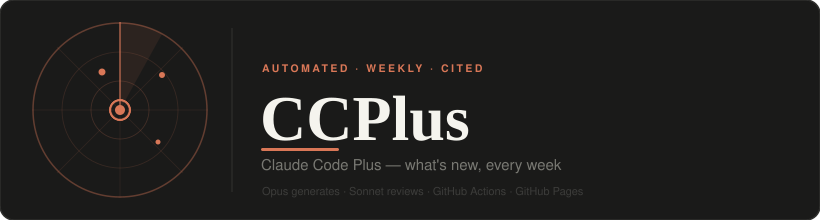
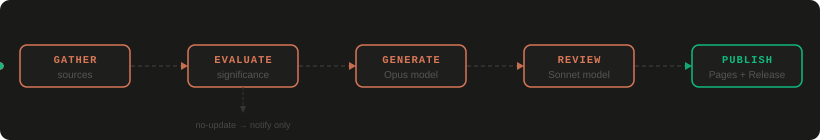

<p align="center">
  
</p>

<p align="center">
  <a href="https://claude-booster.github.io/CCPlus/">
    
  </a>
  &nbsp;
  
  &nbsp;
  
  &nbsp;
  
  &nbsp;
  
</p>

<p align="center">
  An automated pipeline that tracks and surfaces <strong>what's new</strong> in Claude Code —
  updates, tips, techniques, and "hacks" — from Anthropic, the Claude community, and AI experts,
  and publishes it as a <strong>versioned, citation-backed, Anthropic-styled</strong> HTML document.
</p>

---

## Pipeline

<p align="center">
  
</p>

Every Monday at 1:00 PM (or on demand) the pipeline:

1. **Gathers** from the sources in [`config/sources.yaml`](config/sources.yaml) — official Anthropic docs, GitHub Releases API, Hacker News, Reddit, and community experts.
2. **Evaluates significance** against [`state/state.json`](state/state.json) using the rubric in [`config/config.yaml`](config/config.yaml).
   - Nothing significant → **notify only** (`no-update` logged, run-log issue comment sent). No artifact produced.
3. **Generates** `docs/artifacts/CCPlus_<YYYY-MM-DD_HHmm>.html` with Anthropic styling, inline citations, and a History Log diff vs. the prior version.
4. **Reviews** the draft on the opposite model (Opus generates → Sonnet reviews; verdict: `pass / pass_with_edits / fail`). Corrections applied before publish.
5. **Publishes** — updates [`docs/index.html`](docs/index.html), commits, creates a GitHub Release, and posts a run-log comment.

Prior versions are **never overwritten** — each run produces a new timestamped file.

---

## How it runs

| Mode | How |
|------|-----|
| **Weekly (scheduled)** | GitHub Actions cron — Mon 05:00 UTC = 13:00 Asia/Manila |
| **On demand (Actions)** | Actions tab → **CCPlus weekly** → **Run workflow** (check **force** to build even with no significant updates) |
| **On demand (local)** | `/ccplus` skill in any Claude Code session on this repo (`.claude/skills/ccplus/SKILL.md`) |

**Notifications:** a rolling GitHub issue ("📋 CCPlus run log") receives one comment per run — both new-version and no-update runs. Watch the repo (**Watch → All Activity**) to receive these by email.

---

## Repository layout

```
CCPlus/
  config/sources.yaml          # tracked sources (authoritative vs community)
  config/config.yaml           # significance rubric + model choices
  prompts/generate-ccplus.md   # the generator the pipeline runs
  prompts/review-ccplus.md     # cross-model reviewer instructions
  templates/template.html      # Anthropic-styled HTML shell
  state/state.json             # dedup ledger + version/changelog/hash tracking
  state/runlog.json            # per-run status log
  docs/index.html              # GitHub Pages landing page (all versions, newest first)
  docs/assets/                 # banner + pipeline diagram (this page)
  docs/artifacts/CCPlus_*.html # immutable artifact per version
  .githooks/pre-commit         # PII guard hook (committed); reads .githooks/.blocked
  .githooks/.blocked           # blocked patterns (git-ignored, local only)
  .claude/skills/ccplus/       # /ccplus on-demand trigger
  SETUP.md                     # setup & operations guide
```

## Run status legend

| `status` | meaning |
|----------|---------|
| `generated` | a new versioned artifact was produced and published |
| `no-update`  | significance rubric not met; notification only |
| `error`      | run failed; see `note` field in `runlog.json` |

---

*CCPlus is generated with Claude Code. Content is paraphrased from cited public sources; see each artifact's References section.*
